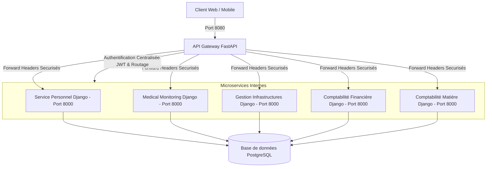

# 🏥 Écosystème Polyclinique Fultang — Guide de Déploiement Complet (Backend)

Bienvenue dans le guide de déploiement et d'administration du backend de la **Polyclinique Fultang**. Ce document fournit toutes les instructions nécessaires pour installer, configurer, déployer et sécuriser l'ensemble de l'architecture microservices.

---

## 📐 Architecture Globale

L'application est structurée en une architecture microservices hautement découplée et sécurisée :



### Rôles du Système & Préfixes de Routage
Chaque service est accessible via l'API Gateway unique (`http://localhost:8080`) :

| Microservice | Rôle Métier | Préfixe Gateway | Port interne |
| :--- | :--- | :--- | :---: |
| **`api-gateway`** | Passerelle & Sécurité (JWT) | `/` | `8080` |
| **`service-personnel`** | Gestion RH & Profils médicaux | `/personnel/` | `8000` |
| **`Medical-Monitoring`** | Patients, Consultations, Hospitalisation | `/medical/` | `8000` |
| **`Gestion-Infrastructures`**| Bâtiments, Étages et Salles | `/infrastructure/` | `8000` |
| **`fultang-compta-financiere`**| Comptabilité générale & Journaux OHADA | `/compta-financiere/` | `8000` |
| **`ComptaMatiere`** | Gestion des stocks, matériels et besoins | `/compta-matiere/` | `8000` |

---

## 🛠️ Prérequis Système

Avant de commencer le déploiement, assurez-vous que votre machine dispose des outils suivants :

* **Docker** (v20.10+) et **Docker Compose** (v2.0+)
* **Python 3.12+** (si déploiement local sans Docker)
* **bash** (pour exécuter les scripts de démarrage automatisés)
* **curl / HTTPie** (pour les tests d'API)

---

## 🚀 Option 1 : Déploiement Conteneurisé avec Docker (Recommandé)

### Étape 1 : Création du réseau partagé
Tous les conteneurs de l'écosystème Fultang communiquent via un réseau Docker externe partagé nommé `fultang_shared_network`. Vous devez le créer manuellement avant de lancer les services :

```bash
docker network create fultang_shared_network
```

### Étape 2 : Lancement des conteneurs
Un script automatisé `start_all.sh` est fourni à la racine du projet pour construire et démarrer l'ensemble des bases de données PostgreSQL et des microservices.

Donnez les permissions d'exécution et lancez-le :

```bash
chmod +x start_all.sh
./start_all.sh
```

*(Note : Le script vous demandera vos accès administrateur `sudo` pour piloter le démon Docker).*

### Étape 3 : Application des Migrations Django
Une fois les conteneurs opérationnels, vous devez exécuter les migrations Django pour chaque microservice afin d'initialiser les schémas de base de données PostgreSQL :

```bash
# 1. Service Personnel
docker compose exec service-personnel python manage.py migrate

# 2. Medical Monitoring
docker compose -f Medical-Monitoring/docker-compose.yml exec medical-backend python manage.py migrate

# 3. Gestion Infrastructures
docker compose -f Gestion-Infrastructures/docker-compose.yml exec infrastructure-web python manage.py migrate

# 4. Comptabilité Financière
docker compose -f fultang-compta-financiere/docker-compose.yml exec compta-financiere-backend python manage.py migrate

# 5. Comptabilité Matière
docker compose -f ComptaMatiere/docker-compose.yml exec compta-matiere-backend python manage.py migrate
```

---

## 💻 Option 2 : Déploiement en Développement (Sans Docker)

Pour travailler en local sans conteneurisation, vous devez exécuter chaque service dans son environnement virtuel dédié et utiliser les configurations par défaut (bases de données locales SQLite configurées en mode dev).

### 1. Démarrer le Service Personnel
```bash
cd service-personnel
# Activer le venv local
source venv/bin/activate
# Appliquer les migrations
python service_personnel/manage.py migrate
# Lancer le serveur sur le port 8001
python service_personnel/manage.py runserver 8001
```

### 2. Démarrer l'API Gateway (FastAPI)
```bash
cd api-gateway
source venv/bin/activate
# Configurer les URLs des services cibles
export SERVICE_PERSONNEL_URL=http://localhost:8001
export SERVICE_MEDICAL_URL=http://localhost:8002
export SERVICE_INFRASTRUCTURE_URL=http://localhost:8003
export SERVICE_COMPTA_FINANCIERE_URL=http://localhost:8004
export SERVICE_COMPTA_MATIERE_URL=http://localhost:8005

# Lancer la gateway sur le port 8080
python -m uvicorn app.main:app --port 8080 --reload
```

*(Répétez des étapes similaires pour les autres services en changeant le port d'écoute Django : `python manage.py runserver <PORT>`)*

---

## 🔒 Authentification & Sécurité

### Cycle de vie d'un jeton (JWT)
1. **Identification** : Le client envoie une requête `POST /auth/login` à la Gateway.
2. **Vérification** : La Gateway relaie les identifiants au `service-personnel` via `/api/auth/verify/`.
3. **Génération** : Si les identifiants sont valides, la Gateway génère un jeton d'accès JWT (`access_token`) et un jeton de renouvellement (`refresh_token`).
4. **Header Trust** : Pour chaque requête ultérieure, le client fournit le JWT dans le header `Authorization: Bearer <TOKEN>`.
5. **Routage Interne** : La Gateway décode le jeton, extrait l'identifiant et les rôles de l'utilisateur, puis injecte les headers suivants avant de relayer la requête au microservice cible :
   * `X-User-ID` : Identifiant unique de l'utilisateur
   * `X-User-Roles` : Rôles associés (ex: `Admin`, `Medecin`, `MedecinGeneraliste`)

### Protection des Endpoints
Tous les microservices de l'écosystème Polyclinique Fultang sont configurés avec :
* `DEFAULT_PERMISSION_CLASSES`: `IsAuthenticated`
* `DEFAULT_AUTHENTICATION_CLASSES`: `GatewayHeaderAuthentication`

Aucune requête directe ou non authentifiée ne peut lire ou modifier les données. Les requêtes sans en-tête valide renvoient systématiquement une erreur `401 Unauthorized` ou `403 Forbidden`.

---

## 🧪 Validation & Tests Manuels

### Comptes de test pré-configurés
| Rôle | Email | Mot de passe |
| :--- | :--- | :--- |
| **Admin (DSI)** | `admin@fultang.local` | `adminpass` |
| **Médecin** | `jean.dupont@fultang.local` | `password123` |

### Commande de Test Rapide (via curl)
Obtenir un token d'accès :
```bash
TOKEN=$(curl -s -X POST http://localhost:8080/auth/login \
  -H "Content-Type: application/json" \
  -d '{"email":"admin@fultang.local","password":"adminpass"}' | python3 -c "import sys, json; print(json.load(sys.stdin)['access_token'])")

echo "Token obtenu : $TOKEN"
```

Interroger le personnel avec le token :
```bash
curl -H "Authorization: Bearer $TOKEN" http://localhost:8080/personnel/medecins/
```

---

## 🩺 Diagnostic et Résolution des Problèmes (Troubleshooting)

### 1. Erreur DNS / Communication Inter-Services (502 Bad Gateway)
Si la Gateway renvoie une erreur `502`, vous pouvez vérifier la résolution des noms DNS internes au réseau Docker avec l'endpoint de debug suivant :
```bash
curl http://localhost:8080/debug-dns
```
Si un service affiche `ERROR`, redémarrez le conteneur concerné.

### 2. Redémarrer un microservice spécifique
Pour reconstruire et relancer un seul service (par exemple après une mise à jour de code) :
```bash
sudo docker compose build <nom-du-service>
sudo docker compose up -d --no-deps <nom-du-service>
```
*Exemple : `sudo docker compose build service-personnel && sudo docker compose up -d --no-deps service-personnel`*

---

## 🖥️ Option 3 : Déploiement sur une Machine Virtuelle (VM) Ubuntu Server

Cette section décrit le déploiement complet de l'écosystème sur une **VM Linux fraîche** (Ubuntu Server 22.04 LTS recommandé). C'est l'approche standard pour un environnement de staging ou de production isolé.

### Étape 0 : Prérequis — Accès à la VM

Connectez-vous à la VM via SSH :
```bash
ssh votre_utilisateur@<ADRESSE_IP_DE_LA_VM>
```

> **Informations réseau** : Notez l'adresse IP de la VM (`ip addr show`). Remplacez `localhost` par cette IP dans toutes les URL de test depuis votre machine hôte.

---

### Étape 1 : Mise à jour du système

```bash
sudo apt update && sudo apt upgrade -y
```

---

### Étape 2 : Installation de Docker et Docker Compose

```bash
# Dépendances HTTPS pour apt
sudo apt install -y ca-certificates curl gnupg lsb-release

# Clé GPG officielle Docker
sudo install -m 0755 -d /etc/apt/keyrings
curl -fsSL https://download.docker.com/linux/ubuntu/gpg | sudo gpg --dearmor -o /etc/apt/keyrings/docker.gpg
sudo chmod a+r /etc/apt/keyrings/docker.gpg

# Ajout du dépôt Docker
echo "deb [arch=$(dpkg --print-architecture) signed-by=/etc/apt/keyrings/docker.gpg] \
  https://download.docker.com/linux/ubuntu $(lsb_release -cs) stable" | \
  sudo tee /etc/apt/sources.list.d/docker.list > /dev/null

# Installation
sudo apt update
sudo apt install -y docker-ce docker-ce-cli containerd.io docker-compose-plugin

# Permettre d'utiliser Docker sans sudo (reconnexion requise après)
sudo usermod -aG docker $USER
newgrp docker
```

Vérification :
```bash
docker --version
docker compose version
```

---

### Étape 3 : Installation de Git et clonage du dépôt

```bash
sudo apt install -y git

# Cloner le dépôt (remplacer par l'URL réelle du dépôt GitHub)
git clone https://github.com/VOTRE_PSEUDO/NOM_DU_DEPOT.git /opt/fultang/backend
cd /opt/fultang/backend
```

---

### Étape 4 : Configuration du Pare-feu (UFW)

Ouvrir uniquement le port de l'API Gateway. Les ports internes des microservices ne doivent **jamais** être exposés publiquement.

```bash
sudo ufw allow OpenSSH     # Garder l'accès SSH
sudo ufw allow 8080/tcp    # API Gateway (point d'entrée unique)
sudo ufw enable
sudo ufw status
```

> ⚠️ **Important** : N'exposez **jamais** les ports internes des microservices (`8000`) directement. Tout le trafic doit passer par la Gateway sur le port `8080`.

---

### Étape 5 : Création du réseau Docker partagé

```bash
docker network create fultang_shared_network
```

---

### Étape 6 : Lancement de l'écosystème complet

```bash
chmod +x start_all.sh
./start_all.sh
```

> 💡 **Note VM** : Sur une VM, l'option `sudo` du script sera utilisée si votre utilisateur n'est pas encore dans le groupe `docker`. Si vous avez suivi l'étape 2, la commande `newgrp docker` rend `sudo` inutile.

---

### Étape 7 : Application des migrations de base de données

Attendez ~10 secondes que tous les conteneurs soient prêts, puis appliquez les migrations :

```bash
# Service Personnel (inclut la migration UUID)
sudo docker compose exec service-personnel python manage.py migrate

# Medical Monitoring
sudo docker compose -f Medical-Monitoring/docker-compose.yml exec medical-backend python manage.py migrate

# Gestion Infrastructures
sudo docker compose -f Gestion-Infrastructures/docker-compose.yml exec infrastructure-web python manage.py migrate

# Comptabilité Financière
sudo docker compose -f fultang-compta-financiere/docker-compose.yml exec compta-financiere-backend python manage.py migrate

# Comptabilité Matière
sudo docker compose -f ComptaMatiere/docker-compose.yml exec compta-matiere-backend python manage.py migrate
```

---

### Étape 8 : Vérification du déploiement

Depuis votre **machine hôte** (en remplaçant `<VM_IP>` par l'IP de la VM) :

```bash
VM_IP="<ADRESSE_IP_DE_LA_VM>"

# 1. Vérifier que la Gateway est accessible
curl http://$VM_IP:8080/

# 2. Vérifier la résolution DNS interne
curl http://$VM_IP:8080/debug-dns

# 3. Vérifier que les endpoints sont protégés (doit retourner 401)
curl -s -o /dev/null -w "Personnel sans token: %{http_code}\n" http://$VM_IP:8080/personnel/medecins/
curl -s -o /dev/null -w "Medical sans token: %{http_code}\n" http://$VM_IP:8080/medical/patients/

# 4. Obtenir un token et tester l'accès complet
TOKEN=$(curl -s -X POST http://$VM_IP:8080/auth/login \
  -H "Content-Type: application/json" \
  -d '{"email":"admin@fultang.local","password":"adminpass"}' \
  | python3 -c "import sys,json; print(json.load(sys.stdin).get('access_token','ECHEC_LOGIN'))")

echo "Token: $TOKEN"

curl -s -o /dev/null -w "Personnel avec token: %{http_code}\n" \
  -H "Authorization: Bearer $TOKEN" http://$VM_IP:8080/personnel/medecins/
```

---

### Étape 9 (Optionnel) : Démarrage automatique au redémarrage de la VM

Pour que tous les services redémarrent automatiquement si la VM redémarre :

```bash
# Activer Docker au démarrage
sudo systemctl enable docker

# Créer un service systemd pour relancer l'écosystème Fultang
sudo tee /etc/systemd/system/fultang.service << 'EOF'
[Unit]
Description=Écosystème Backend Polyclinique Fultang
Requires=docker.service
After=docker.service network-online.target

[Service]
Type=oneshot
RemainAfterExit=yes
WorkingDirectory=/opt/fultang/backend
ExecStart=/bin/bash start_all.sh
ExecStop=/usr/bin/docker compose down
TimeoutStartSec=300

[Install]
WantedBy=multi-user.target
EOF

sudo systemctl daemon-reload
sudo systemctl enable fultang.service
```

---

## 💻 Option 2 : Déploiement en Développement (Sans Docker)

Pour travailler en local sans conteneurisation, vous devez exécuter chaque service dans son environnement virtuel dédié et utiliser les configurations par défaut (bases de données locales SQLite configurées en mode dev).

### 1. Démarrer le Service Personnel
```bash
cd service-personnel
# Activer le venv local
source venv/bin/activate
# Appliquer les migrations
python service_personnel/manage.py migrate
# Lancer le serveur sur le port 8001
python service_personnel/manage.py runserver 8001
```

### 2. Démarrer l'API Gateway (FastAPI)
```bash
cd api-gateway
source venv/bin/activate
# Configurer les URLs des services cibles
export SERVICE_PERSONNEL_URL=http://localhost:8001
export SERVICE_MEDICAL_URL=http://localhost:8002
export SERVICE_INFRASTRUCTURE_URL=http://localhost:8003
export SERVICE_COMPTA_FINANCIERE_URL=http://localhost:8004
export SERVICE_COMPTA_MATIERE_URL=http://localhost:8005

# Lancer la gateway sur le port 8080
python -m uvicorn app.main:app --port 8080 --reload
```

*(Répétez des étapes similaires pour les autres services en changeant le port d'écoute Django : `python manage.py runserver <PORT>`)*

---

## 🔒 Authentification & Sécurité

### Cycle de vie d'un jeton (JWT)
1. **Identification** : Le client envoie une requête `POST /auth/login` à la Gateway.
2. **Vérification** : La Gateway relaie les identifiants au `service-personnel` via `/api/auth/verify/`.
3. **Génération** : Si les identifiants sont valides, la Gateway génère un jeton d'accès JWT (`access_token`) et un jeton de renouvellement (`refresh_token`).
4. **Header Trust** : Pour chaque requête ultérieure, le client fournit le JWT dans le header `Authorization: Bearer <TOKEN>`.
5. **Routage Interne** : La Gateway décode le jeton, extrait l'identifiant et les rôles de l'utilisateur, puis injecte les headers suivants avant de relayer la requête au microservice cible :
   * `X-User-ID` : Identifiant unique de l'utilisateur
   * `X-User-Roles` : Rôles associés (ex: `Admin`, `Medecin`, `MedecinGeneraliste`)

### Protection des Endpoints
Tous les microservices de l'écosystème Polyclinique Fultang sont configurés avec :
* `DEFAULT_PERMISSION_CLASSES`: `IsAuthenticated`
* `DEFAULT_AUTHENTICATION_CLASSES`: `GatewayHeaderAuthentication`

Aucune requête directe ou non authentifiée ne peut lire ou modifier les données. Les requêtes sans en-tête valide renvoient systématiquement une erreur `401 Unauthorized` ou `403 Forbidden`.

---

## 🧪 Validation & Tests Manuels

### Comptes de test pré-configurés
| Rôle | Email | Mot de passe |
| :--- | :--- | :--- |
| **Admin (DSI)** | `admin@fultang.local` | `adminpass` |
| **Médecin** | `jean.dupont@fultang.local` | `password123` |

### Commande de Test Rapide (via curl)
Obtenir un token d'accès :
```bash
TOKEN=$(curl -s -X POST http://localhost:8080/auth/login \
  -H "Content-Type: application/json" \
  -d '{"email":"admin@fultang.local","password":"adminpass"}' | python3 -c "import sys, json; print(json.load(sys.stdin)['access_token'])")

echo "Token obtenu : $TOKEN"
```

Interroger le personnel avec le token :
```bash
curl -H "Authorization: Bearer $TOKEN" http://localhost:8080/personnel/medecins/
```

---

## 🩺 Diagnostic et Résolution des Problèmes (Troubleshooting)

### 1. Erreur DNS / Communication Inter-Services (502 Bad Gateway)
Si la Gateway renvoie une erreur `502`, vous pouvez vérifier la résolution des noms DNS internes au réseau Docker avec l'endpoint de debug suivant :
```bash
curl http://localhost:8080/debug-dns
```
Si un service affiche `ERROR`, redémarrez le conteneur concerné.

### 2. Redémarrer un microservice spécifique
Pour reconstruire et relancer un seul service (par exemple après une mise à jour de code) :
```bash
sudo docker compose build <nom-du-service>
sudo docker compose up -d --no-deps <nom-du-service>
```
*Exemple : `sudo docker compose build service-personnel && sudo docker compose up -d --no-deps service-personnel`*

### 3. Erreur de migration PostgreSQL : `cannot cast type integer to uuid`
Ce bug connu survient lorsque la migration `0003` du service-personnel tente de convertir des clés primaires entières en UUID. Il est **corrigé** dans ce dépôt via `RunSQL`. Si vous le rencontrez :
```bash
# Reconstruire proprement et relancer les migrations
sudo docker compose down -v  # ⚠️ Supprime les volumes (données de dev uniquement)
sudo docker compose up -d
sleep 5
sudo docker compose exec service-personnel python manage.py migrate
```

### 4. Vérifier les logs d'un service
```bash
# Logs en temps réel
sudo docker compose logs -f service-personnel

# Ou pour les services secondaires
sudo docker compose -f Medical-Monitoring/docker-compose.yml logs -f
```

### 5. Vérifier l'état de tous les conteneurs
```bash
sudo docker ps --format "table {{.Names}}\t{{.Status}}\t{{.Ports}}"
```
